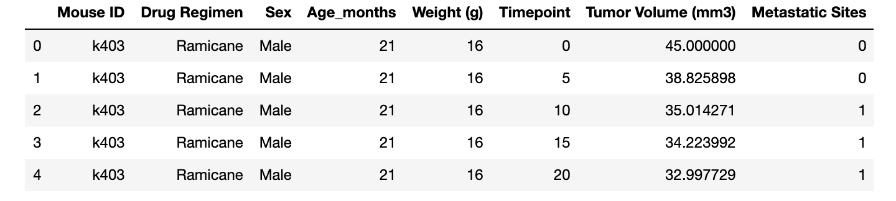
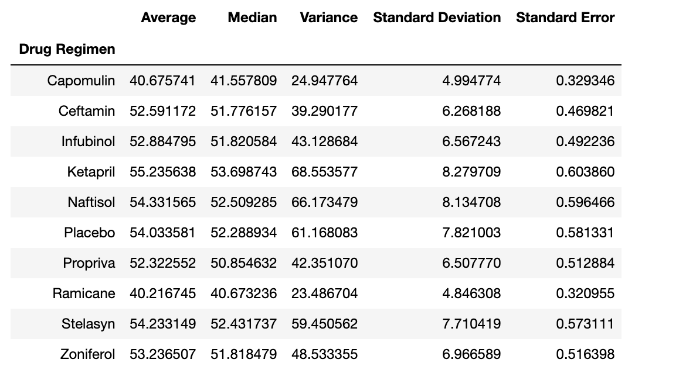
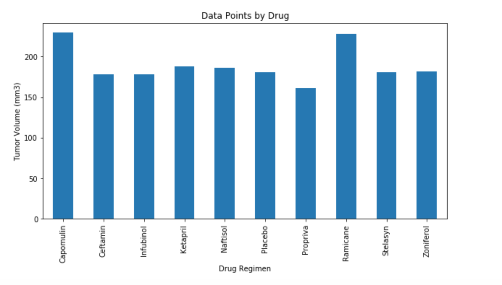
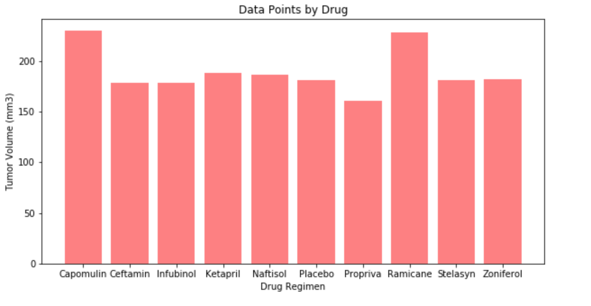
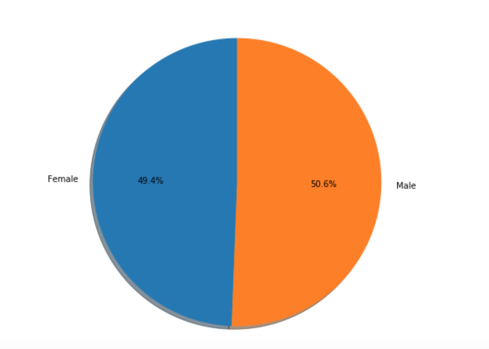
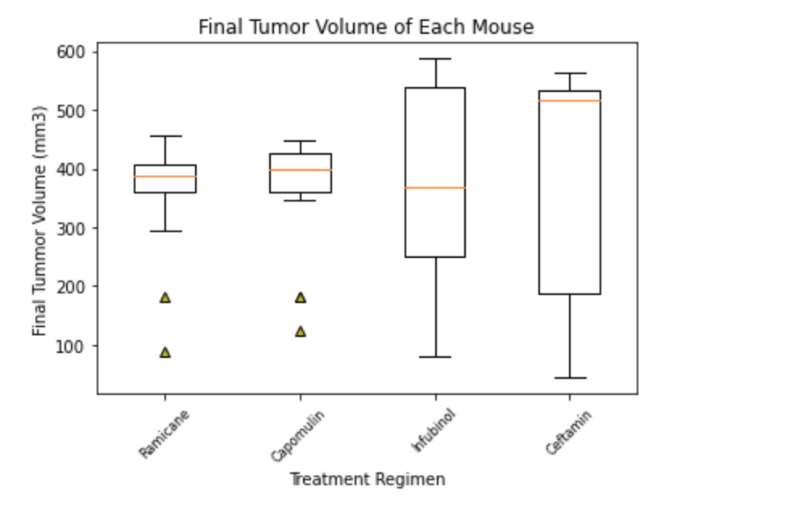
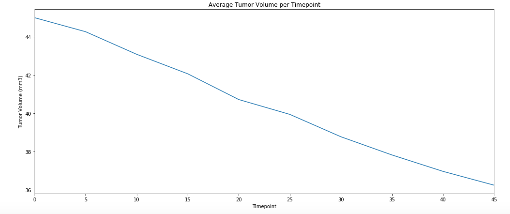
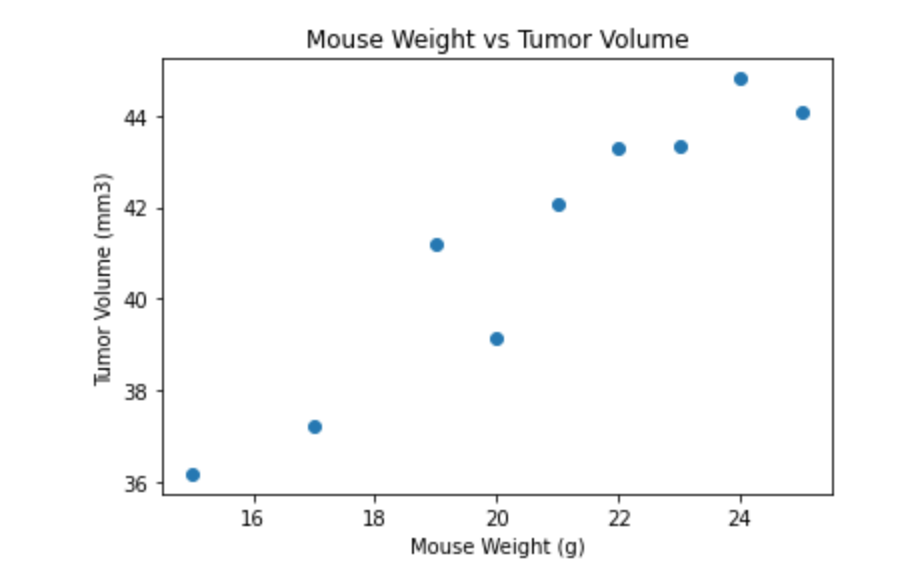

# Matplotlib

## **Background** 
What good is data without a good plot to tell the story?

In this study, 250 mice identified with SCC tumor growth were treated through a variety of drug regimens. Over the course of 45 days, tumor development was observed and measured. The purpose of this study was to compare the performance of the drug of interest, Capomulin, versus the other treatment regimens.

**The task was to to generate all of the tables and figures needed for the technical report of the study as well as a top-level summary of the study results.**

# **Methods and Results** 

* The following Dependencies were imported

    * Matplotlib.pyplot as plt
    * Pandas as pd
    * Scipy.stats as st
    * Numpy as np

The Mouse Data and Study Results csv files were pulled using a relative path then read and merged using Pandas. The image below displays the resulting dataset. 

Using the merged dataset above a summary statistics table was generated. The mean, median, variance, standard deviation, and SEM of the tumor volume for each drug regimen was calculated with Numpy and Scipy then put into the resulting DataFrame below. 

**As we could see from the table the drug of interest, Capomulin , had some very promising results. In comparison with the other drugs in the study Capomulin had one of the lowest Average Tumor Volume with one of the the lowest Standard Deviation and Standard Error as well.**

Both Pandas's `DataFrame.plot()` and Matplotlib's `pyplot` methods were used to generate a bar plot that shows the number of data points for each treatment regimen which is displayed below.

* Pandas Bar Plot
    * 

* Matplotlib.pyplot Bar Plot
    * 

**As we could see from both the Matplotlib.pyplot Bar Plot and Pandas Bar Plot that the drugs with the most data points are Capomulin and Ramicane which suggests much greater accurate results.** 

Both Pandas's `DataFrame.plot()` and Matplotlib's `pyplot` methods were used to generate a pie plot that shows the distribution of female or male mice in the study which is displayed below. 

     **NOTE:** These plots look identical so only one is displayed.

**The above graph displays that there is a pretty even distrubtion between male and female mice.**

The final tumor volume of each mouse across four of the most promising treatment regimens: Capomulin, Ramicane, Infubinol, and Ceftamin was calculated as well as the quartiles and Interquartile Ranges Potential outliers were quantitatively determined across all four drug regimens also.

Using Matplotlib, a box and whisker plot was generated of the final tumor volume for all four treatment regimens which is displayed below with potential outliers being highlighted with differnt color and style. 

A line plot of time point versus tumor volume for a single mouse treated with Capomulin was generated as seen below. 

**As we could see from the plot above that tumor volume dramatically decreased as time went on under the Capomulin treatment regimen.**

A scatter plot of mouse weight versus average tumor volume for the Capomulin treatment regimen was generated and displayed below. 

**The graph above shows that there is a strong correlation with mouse weight and tumor volume. The larger the mouse the larger the tumor volume.**

